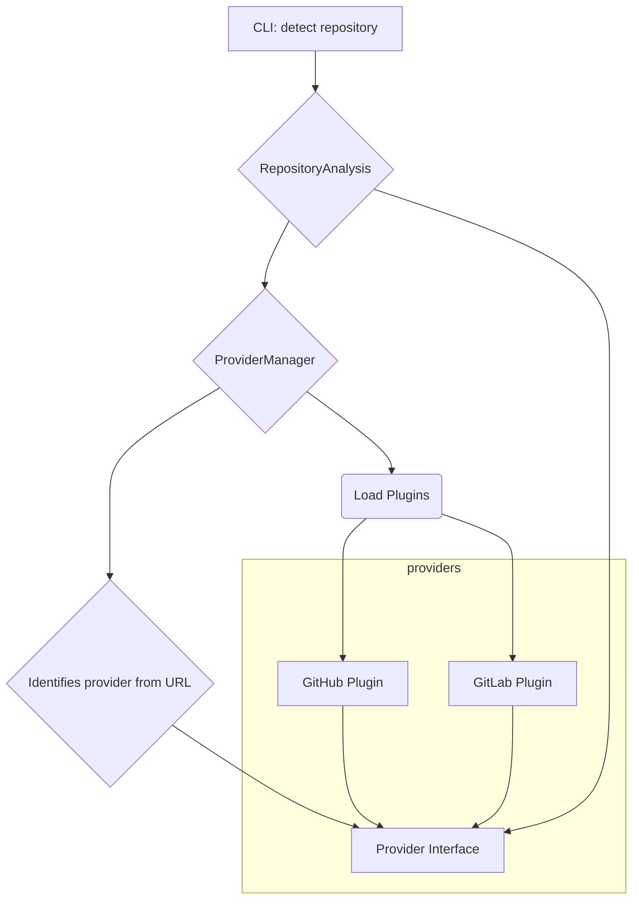

## Provider Plugins


Plugin directory structure
```
metagit/
└── providers/
    ├── __init__.py
    ├── base.py          # Defines the base provider interface
    ├── manager.py       # Manages plugin discovery and loading
    ├── github.py        # GitHub provider plugin
    └── gitlab.py        # GitLab provider plugin (for the future)
```