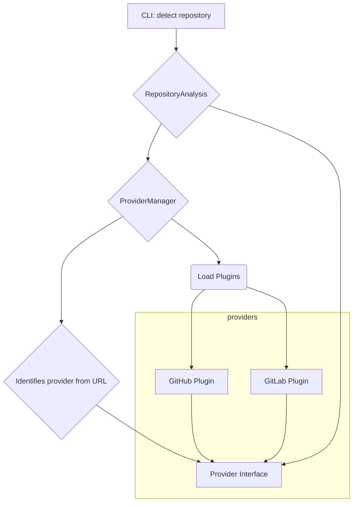

# Metagit Development Guide

Upon making changes run the following to validate everything before submitting a PR

```bash
task format lint:fix test
```

# API

## Standard

Start then test the api.

```bash
task docker:compose
task api:test:detect

curl -X 'GET' \
  'http://localhost:8000/detect' \
  -H 'accept: application/json'

# Stop services
docker compose stop
```

To develop locally with all the needed containers running while still having the api running as a continually reloading/watched local service:

```bash
task api:dev

uv run -m metagit.api.main

# Stop services
docker compose -f docker-compose.dev.yml stop
```

## Multitenant

```bash
# Start services
task docker:compose:multitenant

# Stop services
docker compose -f docker-compose.multitenant.yml stop
```

[opensearch](http://localhost:9200)
[opensearch-dashboards](http://localhost:5601)
[api](http://localhost:8000)
[api docs](http://localhost:8000/docs)

## Provider Plugins


Plugin directory structure
```
metagit/
└── providers/
    ├── __init__.py
    ├── base.py          # Defines the base provider interface
    ├── manager.py       # Manages plugin discovery and loading
    ├── github.py        # GitHub provider plugin
    └── gitlab.py        # GitLab provider plugin (for the future)
```