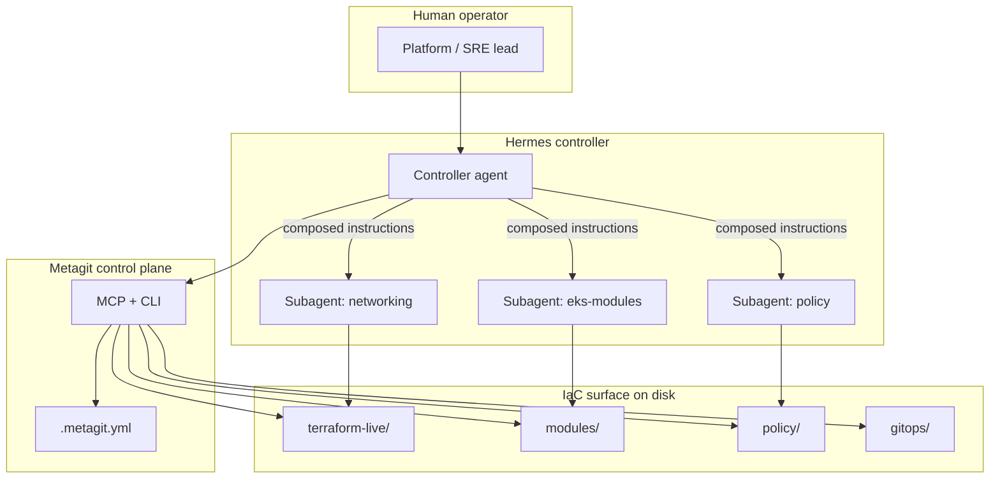
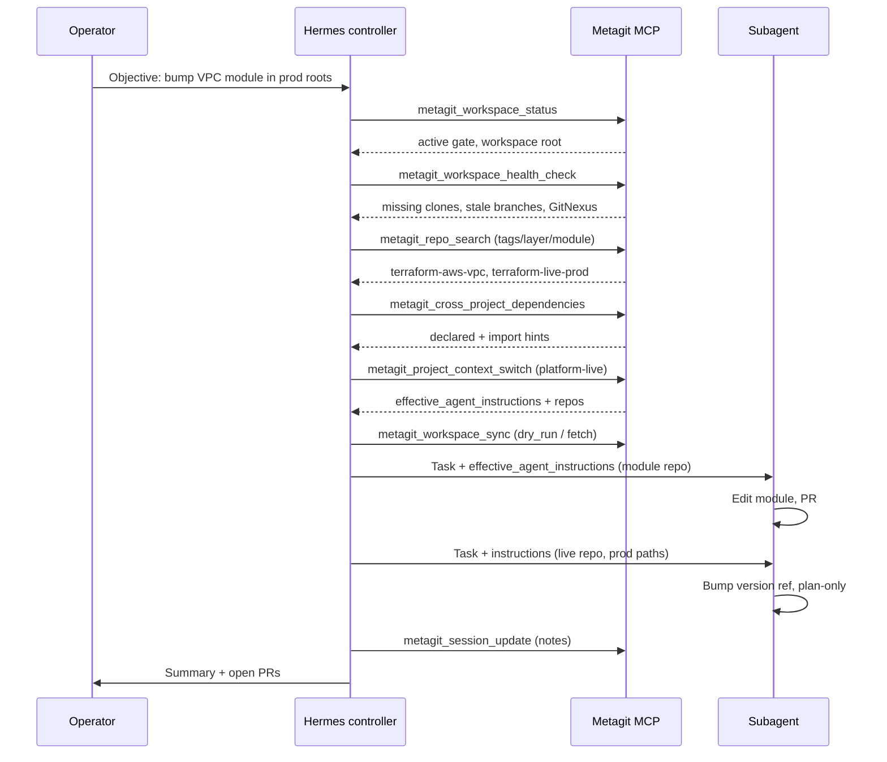
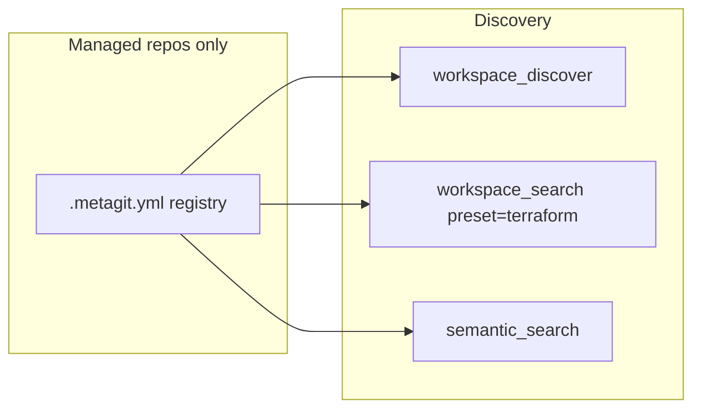
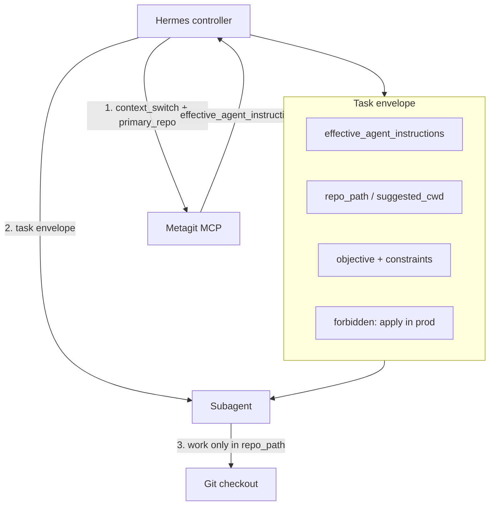

# Hermes agents and organization-wide IaC

This guide shows how a **Hermes** controller agent uses **Metagit** as the control plane for an entire organization's infrastructure-as-code (IaC) surface: Terraform, OpenTofu, Pulumi, policy repos, modules, and the application repos they provision.

Metagit does not replace Terraform or your cloud provider. It gives Hermes a **single, validated map** of every managed repository, plus MCP tools to search, inspect, sync, triage, and hand **layered instructions** to subagents working in specific repos.

---

## Roles in the stack

| Role | Responsibility |
|------|----------------|
| **Hermes (controller)** | Owns the user objective across many repos; reads workspace manifest; launches subagents with composed `agent_instructions`; never clones blindly. |
| **Metagit** | Source of truth for workspace layout, repo metadata, health, search, and guarded git operations. |
| **Subagents (workers)** | Execute in one repo or path at a time (module bump, policy fix, drift investigation) using instructions from the controller. |
| **Git + CI** | Actual IaC execution (`plan`/`apply`, policy checks) stay in each repository's pipelines. |



---

## Mapping org IaC to Metagit

Think of one **umbrella workspace** that models the whole platform engineering estate.

```text
Organization IaC estate
└── Metagit workspace (umbrella .metagit.yml)
    ├── Project: platform-live          # Terragrunt / root modules per env
    │   ├── Repo: terraform-live-prod
    │   └── Repo: terraform-live-staging
    ├── Project: shared-modules         # Reusable TF modules
    │   ├── Repo: terraform-aws-vpc
    │   └── Repo: terraform-aws-eks
    ├── Project: policy                 # OPA, Sentinel, Checkov baselines
    │   └── Repo: org-policy
    └── Project: delivery               # Pipelines, Atlantis, runners
        └── Repo: cicd-terraform
```

On disk (typical layout under app config `workspace.path`, often `.metagit/`):

```text
.metagit/
├── platform-live/
│   ├── terraform-live-prod/
│   └── terraform-live-staging/
├── shared-modules/
│   ├── terraform-aws-vpc/
│   └── terraform-aws-eks/
├── policy/
│   └── org-policy/
└── delivery/
    └── cicd-terraform/
```

**Tags** on each `repos[]` entry (for example `tier: "1"`, `iac: "terraform"`, `env: "prod"`) let Hermes filter with `metagit_repo_search` / `metagit search` without scanning the filesystem.

---

## Layered `agent_instructions`

Instructions are optional at four levels. Hermes composes them when switching project context or launching a subagent focused on a repo.

| Layer | YAML location | Typical IaC content |
|-------|---------------|---------------------|
| **File** | top-level `agent_instructions` | Org-wide rules: naming, approval, no `apply` in prod without ticket. |
| **Workspace** | `workspace.agent_instructions` | How to use this umbrella: backends, state buckets, module sources. |
| **Project** | `workspace.projects[].agent_instructions` | Project boundary: "platform-live = Terragrunt only; never edit modules here." |
| **Repo** | `workspace.projects[].repos[].agent_instructions` | Repo-specific: "Subagent: only `env/prod/**`; run `terraform fmt` before commit." |

Legacy manifests may still use `agent_prompt`; Metagit accepts it on load and writes `agent_instructions` going forward.

**Example manifest excerpt:**

```yaml
name: acme-platform-iac
kind: umbrella
agent_instructions: |
  Controller: You manage Acme's IaC estate. Never run terraform apply.
  Coordinate subagents per repo. Always run plan-only unless user explicitly approves apply.

workspace:
  agent_instructions: |
    Remote state: s3://acme-tf-state/{project}/{env}.
    Module sources: git::ssh://git@github.com/acme/terraform-modules.git//...
  projects:
    - name: platform-live
      description: Live infrastructure roots per environment
      agent_instructions: |
        Use Terragrunt. Respect dependency order: network before compute.
      repos:
        - name: terraform-live-prod
          path: platform-live/terraform-live-prod
          url: git@github.com:acme/terraform-live-prod.git
          sync: true
          tags:
            iac: terraform
            env: prod
          agent_instructions: |
            Subagent scope: env/prod only. Required checks: fmt, validate, tflint.
        - name: terraform-live-staging
          path: platform-live/terraform-live-staging
          sync: true
          tags:
            iac: terraform
            env: staging
    - name: shared-modules
      agent_instructions: |
        Semver tag modules on release. No environment-specific values in modules/.
      repos:
        - name: terraform-aws-vpc
          path: shared-modules/terraform-aws-vpc
          sync: true
          tags:
            iac: terraform
            layer: module
```

**Composed output** (what subagents receive via `effective_agent_instructions`):

```text
[FILE]
Controller: You manage Acme's IaC estate...

---

[WORKSPACE]
Remote state: s3://acme-tf-state/...

---

[PROJECT]
Use Terragrunt. Respect dependency order...

---

[REPO]
Subagent scope: env/prod only...
```

---

## One-time setup for Hermes

Install the CLI and agent integrations on the host where Hermes runs (or in the umbrella repo CI image):

```bash
uv tool install metagit-cli
metagit version

# Bundled skills (control center, multi-repo, gitnexus, projects, …)
metagit skills install --scope user --target hermes

# MCP server for tool calls from Hermes
metagit mcp install --scope user --target hermes
```

Bootstrap the umbrella coordinator (if not already present):

```bash
cd /path/to/platform-umbrella
metagit init --kind umbrella
metagit project repo add --project platform-live --prompt
metagit config validate
metagit project sync
```

Point Hermes MCP at the workspace root (directory containing `.metagit.yml`):

```bash
metagit mcp serve --root /path/to/platform-umbrella
# or: metagit mcp serve --status-once   # verify gate is active
```

!!! note "Gate behavior"
    Until `.metagit.yml` exists and validates, MCP exposes only safe tools (`metagit_workspace_status`, bootstrap plan). Full workspace tools unlock when the gate is **active**.

---

## Controller session lifecycle



### Step-by-step (controller checklist)

1. **Orient** — `metagit_workspace_status`, read `metagit://workspace/config` and `metagit://workspace/repos/status`.
2. **Hygiene** — `metagit_workspace_health_check` (clone missing repos, note drift/stale integration).
3. **Scope** — `metagit_repo_search` / `metagit search` with tags (`iac=terraform`, `env=prod`).
4. **Blast radius** — `metagit_cross_project_dependencies` from the module or live project; optional GitNexus `analyze` + semantic search for unknown callers.
5. **Focus** — `metagit_project_context_switch` with `project_name` and optional `primary_repo` for the first subagent.
6. **Refresh** — `metagit_workspace_sync` with `mode: fetch` (default); `pull`/`clone` only with explicit approval.
7. **Delegate** — Pass `effective_agent_instructions` and repo path to each subagent; use per-repo `agent_instructions` when tasks split across repos.
8. **Remember** — `metagit_session_update` before switching projects; optional `metagit_workspace_state_snapshot` for audit metadata.

---

## IaC-focused Metagit capabilities

### Discover and search

| Need | Tool | Notes |
|------|------|--------|
| Find all `.tf` under managed repos | `metagit_workspace_discover` | `intent: terraform` or `pattern: "**/*.tf"` |
| Grep module sources / backends | `metagit_workspace_search` | `preset: terraform`, `query: "module \""` |
| Concept-level search | `metagit_workspace_semantic_search` | Requires GitNexus index per repo |
| List repos by tag | `metagit_repo_search` | `tags`, `status`, `sync_enabled` |



### Upstream triage

When a subagent hits an error in one repo (provider version, shared module API), the controller uses **`metagit_upstream_hints`** with a blocker string instead of guessing which module repo to open.

Typical flow:

1. Subagent reports: `Error: Unsupported argument "xyz" in module vpc`.
2. Controller runs upstream hints + workspace search for `module "vpc"` / path hints.
3. Controller reassigns or spawns subagent on `terraform-aws-vpc` with module-level `agent_instructions`.

### Health and drift

`metagit_workspace_health_check` surfaces:

- Repos not cloned (`configured_missing` → `clone` recommendation)
- Dirty trees and commits behind origin (`sync`)
- Branch age / merge-base staleness (`review_branch_age`, `reconcile_integration`)
- GitNexus index stale (`analyze`)

For IaC teams, **integration staleness** often means live roots have not merged default branch since a module release.

### Cross-project dependencies

`metagit_cross_project_dependencies` combines:

- Declared edges in `.metagit.yml`
- Import hints from manifests (`package.json`, etc., where relevant)
- URL matches across repos

Use this before org-wide module version bumps to build an ordered rollout: **modules → policy → live roots**.

---

## Subagent launch pattern

Hermes should treat each subagent as a **scoped worker**:



**Task envelope fields (recommended):**

- `effective_agent_instructions` — full composed stack from Metagit.
- `repo_path` — absolute path from context bundle (`suggested_cwd` or `primary_repo`).
- `objective` — one sentence the controller owns.
- `evidence` — links to search hits, dependency graph snippet, health row.
- `stop_conditions` — e.g. "stop after plan output; do not push."

Subagents should **not** maintain a parallel repo list; they trust Metagit's index for path resolution.

---

## Example: org-wide provider bump

**Objective:** Bump AWS provider `~> 5.0` across all Terraform roots.

| Phase | Controller action | Metagit tools |
|-------|-------------------|---------------|
| Inventory | List prod/staging roots | `metagit_repo_search`, tags `iac=terraform` |
| Order | Modules before live | `metagit_cross_project_dependencies` |
| Hygiene | Fetch latest | `metagit_workspace_sync`, `only_if: behind_origin`, `dry_run` first |
| Work 1 | Subagent on each module repo | `project_context_switch` + repo instructions |
| Work 2 | Subagent per live repo | `workspace_search` for `required_providers` |
| Verify | Health + notes | `workspace_health_check`, `session_update` |

---

## Skills Hermes should load

Install bundled skills with `metagit skills install --target hermes`. High-value skills for IaC controllers:

| Skill | Use when |
|-------|----------|
| `metagit-control-center` | Every multi-repo session |
| `metagit-projects` | Before creating folders or registering repos |
| `metagit-workspace-scope` | Session start |
| `metagit-multi-repo` | Features spanning repos |
| `metagit-workspace-sync` | Refreshing checkouts |
| `metagit-upstream-triage` | Errors that may originate in another repo |
| `metagit-gitnexus` | Before semantic search or impact questions |
| `metagit-repo-impact` | Planning module or API changes |
| `metagit-gating` | MCP inactive / missing config |
| `metagit-release-audit` | Before hand-off (`task qa:prepush` on metagit-cli itself) |

---

## Safety rules (IaC)

- **No `apply` in controller or subagent prompts** unless the human explicitly requests it; prefer plan-only language in `agent_instructions`.
- **No unscoped sync** — use `repos: ["project/repo"]`, not `all`, unless the objective requires it.
- **Mutations** — `pull` / `clone` require `allow_mutation: true` in MCP; default to `fetch`.
- **Secrets** — never put credentials in `agent_instructions` or `env_overrides`; use existing secrets tooling and variable refs in `.metagit.yml`.
- **Config edits** — validate after every manifest change: `metagit config validate`.
- **Register before clone** — follow `metagit-projects`: search managed config before creating directories.

---

## Related documentation

- [Terminology](terminology.md) — workspace, project, repo definitions
- [CLI Reference](cli_reference.md) — MCP tool parameters
- [Installation](install.md) — CLI and skills install
- [Application Logic](app.logic.md) — component overview

For local JSON automation without MCP, `metagit api serve` exposes managed-repo search under `/v1/repos/search` (read-only); the Hermes-oriented MCP surface remains the primary control-plane integration.
