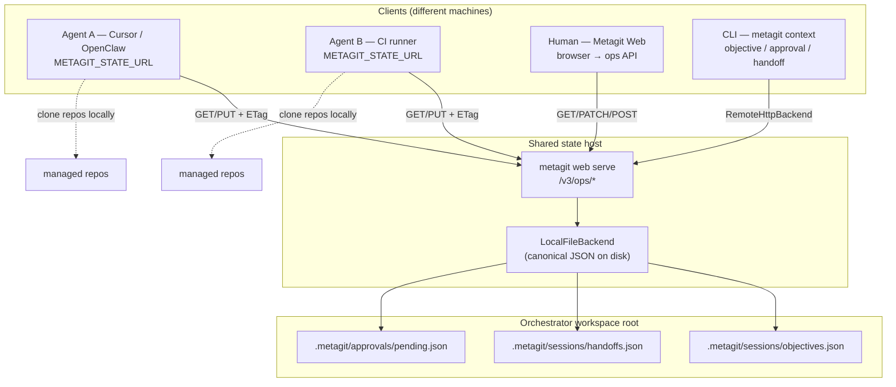

# Sharing state across a team

Metagit stores **coordination data** — objectives, handoffs, approvals, and the
events feed — under `.metagit/` in each workspace root. By default this is local
JSON on disk with optimistic concurrency (content-hash tokens and file locking).
You can opt into a **remote HTTP backend** so several machines and agents share
one canonical state through a metagit ops server.

Related docs:

- [Metagit for AI agents](../agents.md#human--agent-shared-state) — CLI/MCP usage from agents
- [Metagit Web UI](metagit-web.md#shared-coordination-state) — SPA + ops HTTP routes
- [Hermes orchestrator workspace](../hermes-orchestrator-workspace.md) — multi-repo control plane

## Multi-agent architecture

When several agents (and humans) work the same workspace from different hosts,
point every metagit client at one **state server**. Each client still runs
`metagit context objective …`, MCP `metagit_objective_*`, or the web UI — but
persistence goes through HTTP instead of local JSON files.



**Typical flow**

1. Run `metagit web serve` on a coordinator host (Hermes control plane or shared VM).
2. Set `state.url` (or `METAGIT_STATE_URL`) on every agent machine to that host.
3. Agent A sets an objective to `in_progress`; Agent B lists objectives via MCP and
   sees the same row; the human edits `human_notes` in the web Objectives tab.
4. Concurrent writes use content tokens (`ETag` / `If-Match`); services retry once
   on conflict (`state.conflict_retries`, default `1`).

Repo clones stay **local per machine** — only coordination JSON is shared.

## Default (local)

No configuration is required. Objectives live at
`.metagit/sessions/objectives.json`, handoffs at
`.metagit/sessions/handoffs.json`, and approvals at
`.metagit/approvals/pending.json`. Existing CLI and web behavior is unchanged.

## Remote backend

Point clients at an ops server base URL (for example the host running
`metagit web serve`):

```yaml
# ~/.config/metagit/config.yml
config:
  state:
    backend: http
    url: http://127.0.0.1:8787
    token: your-bearer-token
    conflict_retries: 1
```

Environment overrides (take precedence over the file):

| Variable | Purpose |
|----------|---------|
| `METAGIT_STATE_URL` | Ops server base URL |
| `METAGIT_STATE_BACKEND` | Set to `http` to force remote |
| `METAGIT_STATE_TOKEN` | Bearer token for `Authorization` |

If `state.token` is empty, metagit falls back to `api_key` when present.

### Agent client setup

On each agent host (after `uv tool install metagit-cli`):

```bash
export METAGIT_AGENT_MODE=true
export METAGIT_STATE_URL=https://coordinator.example.com:8787
export METAGIT_STATE_TOKEN='…'   # or set state.token in app config

# Same commands as local — backend is transparent
metagit context objective list --json
echo '{"id":"ship-api","status":"in_progress","title":"Ship API","repos":["platform/api"]}' \
  | metagit context objective set
```

MCP tools (`metagit_objective_list`, `metagit_objective_upsert`, approval/handoff
tools) use the same stores and inherit the configured backend automatically.

## Deployment shapes

1. **Orchestrator serves state** — run `metagit web serve` on a shared host;
   clients set `state.url` to that host. The server persists documents on its
   workspace root using `LocalFileBackend` and exposes whole-document routes (below).
2. **Any HTTP endpoint** — implement the same contract; `RemoteHttpBackend`
   uses stdlib `urllib` with `If-Match` / `ETag` for compare-and-swap writes.

Granular web routes (`POST /v3/ops/objectives`, `PATCH …/{id}`, approval
resolve) remain available for the SPA. Remote clients and `RemoteHttpBackend`
use the **whole-document PUT** routes for parity with on-disk JSON envelopes.

## HTTP contract (whole-document state)

Base URL = `state.url` (no trailing slash required). Send
`Authorization: Bearer <token>` when a token is configured.

| Method | Path | Purpose |
|--------|------|---------|
| `GET` | `/v3/ops/objectives` | List objectives; response includes `ETag` header (SHA-256 of document) |
| `PUT` | `/v3/ops/objectives` | Replace document; body `{"objectives":[…]}`; require `If-Match` |
| `GET` | `/v3/ops/approvals?status=all` | Full approval queue (remote backend uses `status=all`) |
| `PUT` | `/v3/ops/approvals` | Replace document; body `{"requests":[…]}`; require `If-Match` |
| `GET` | `/v3/ops/handoffs` | List handoffs; `ETag` on response |
| `PUT` | `/v3/ops/handoffs` | Replace document; body `{"handoffs":[…]}`; require `If-Match` |
| `POST` | `/v3/ops/handoffs` | Append one handoff (no prior token); body = single `HandoffItem` |
| `GET` | `/v3/ops/events?since=<iso>` | Incremental event feed (`WorkspaceEventsResult`) |

### Optimistic concurrency

- **Empty document:** `ETag` absent on `GET`; first `PUT` sends `If-Match: ""`.
- **Existing document:** `GET` returns `ETag: "<sha256-hex>"`; `PUT` must send matching `If-Match`.
- **Stale write:** server responds **`412 Precondition Failed`**; metagit raises
  `StateConflictError` and mutating services retry (reload + reapply).

Example — read/modify/write objectives:

```bash
BASE=http://127.0.0.1:8787
AUTH="Authorization: Bearer $METAGIT_STATE_TOKEN"

# Read current doc + token
ETAG=$(curl -sSI "$BASE/v3/ops/objectives" -H "$AUTH" | awk -F': ' '/^etag:/ {print $2; exit}' | tr -d '\r')
curl -sS "$BASE/v3/ops/objectives" -H "$AUTH" | jq .

# Replace whole document (If-Match required)
curl -sS -X PUT "$BASE/v3/ops/objectives" \
  -H "$AUTH" -H "Content-Type: application/json" \
  -H "If-Match: ${ETAG:-\"\"}" \
  -d '{"objectives":[{"id":"demo-1","title":"Shared objective","status":"in_progress","repos":[],"created_at":"2026-01-01T00:00:00+00:00","updated_at":"2026-01-01T00:00:00+00:00"}]}'
```

Append handoff (no CAS on prior document token):

```bash
curl -sS -X POST "$BASE/v3/ops/handoffs" \
  -H "$AUTH" -H "Content-Type: application/json" \
  -d '{"id":"h-1","title":"Investigate flake","created_by":"agent-a","created_at":"2026-01-01T00:00:00+00:00","updated_at":"2026-01-01T00:00:00+00:00"}'
```

## Security

- Require a bearer token for remote access beyond loopback.
- Terminate TLS in front of the ops server in production (reverse proxy or
  load balancer). Restrict `state.url` to `http`/`https` schemes.
- Tokens are redacted in `metagit appconfig preview` output (`***` + last four chars).
- Do not bind `metagit web serve` to `0.0.0.0` without TLS and auth in front — see
  [Metagit Web security](metagit-web.md#security).

## Concurrency

Mutating services retry on `StateConflictError` up to `state.conflict_retries`
times (default `1`). Handoff **create** uses the backend `append` fast path (no
CAS on the prior document token).

## Troubleshooting

| Symptom | Likely cause | Fix |
|---------|----------------|-----|
| `412` / `StateConflictError` under load | Two writers touched the same document | Expected — retry succeeds; increase `conflict_retries` if needed |
| Agents see different objectives | Mixed local + remote backends | Ensure **all** clients set `METAGIT_STATE_URL` or leave all on default local |
| `remote state url must be http(s)` | Invalid `state.url` scheme | Use `http://` or `https://` with host |
| Empty `ETag` on first PUT fails | Missing `If-Match` | Send `If-Match: ""` for empty documents |
| MCP shows stale objectives | Client cache / no reload | MCP tools reload from backend each call; check `gate/status` → `state_backend` and coordinator URL |

## MCP integration

Coordination tools and resources use the same `resolve_backend()` path as the CLI.
No separate remote MCP tools — configure the **MCP server host**:

```bash
export METAGIT_STATE_URL=https://coordinator.example.com:8787
export METAGIT_STATE_TOKEN='…'
metagit mcp serve --root /path/to/manifest-root
```

| Surface | Names |
|---------|--------|
| **Tools** | `metagit_objective_*`, `metagit_approval_*`, `metagit_handoff_*`, `metagit_events` |
| **Resources** | `metagit://objectives`, `approvals/pending`, `handoffs/open`, `events/recent?since=` |
| **Diagnostics** | `metagit://gate/status` → `state_backend.backend`, `token_configured`, `env_overrides` |

Bundled skill: **`metagit-sharing-state`**. See [agents guide](../agents.md#shared-coordination-state-multi-agent).

## Implementation reference

- Package: `src/metagit/core/state/` (`LocalFileBackend`, `RemoteHttpBackend`, `resolve_backend`)
- Ops handlers: `src/metagit/core/web/ops_handler.py`
- Plan: `docs/superpowers/plans/2026-07-01-remote-state-backend.md`
