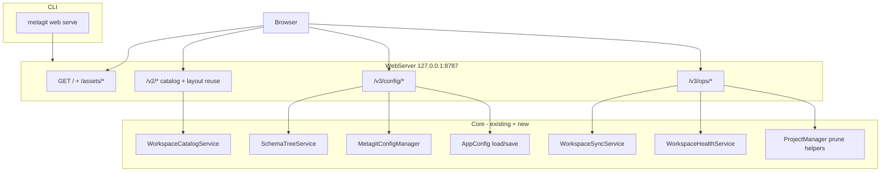

# Metagit Web — Design Spec

**Date:** 2026-05-20  
**Status:** Approved (scope B — Phase 1 + Phase 2 in first release)  
**Command:** `metagit web serve`

---

## Summary

`metagit web` is a localhost-native web application bundled inside the Python package. It provides:

1. **Config Studio** — schema-aware editing of `.metagit.yml` and `metagit.config.yaml` with all Pydantic-defined fields visible; optional undefined fields appear greyed out with enable/disable toggles.
2. **Workspace Console** — browse synced and unsynced repositories, run sync (fetch/pull/clone), health checks, and prune operations with confirmation and dry-run defaults.

The server reuses existing core services and extends the local HTTP pattern established by `metagit api serve`. v1/v2 JSON API routes remain stable; web-specific routes live under `/v3/*`.

---

## Goals

- Launch via `metagit web serve` with optional `--open` to open the browser.
- Edit both metagit manifest (`.metagit.yml`) and app config (`metagit.config.yaml`) through a unified schema tree UI.
- Show every schema element; distinguish **enabled** (present in active config) vs **disabled** (available but omitted).
- Provide light/dark mode with smooth, accessible UI.
- Browse workspace projects/repos with clear synced vs missing status.
- Execute sync, health, and prune from the UI with the same guardrails as CLI/MCP (dry-run first, explicit confirmation for destructive actions).
- Validate all writes through existing Pydantic managers — no bypass paths.

## Non-Goals (v1)

- Multi-workspace switcher / hosted deployment.
- Catalog mutations (add/remove project/repo) in UI — deferred to Phase 3.
- Layout rename/move in UI — deferred to Phase 3.
- Source sync wizard — deferred to Phase 3.
- WebSocket transport — use SSE or polling for long-running jobs.
- FastAPI/Starlette — keep stdlib `ThreadingHTTPServer` pattern.

---

## Architecture



### Module layout

```
src/metagit/
  cli/commands/web.py
  core/web/
    server.py              # build_web_server()
    static_handler.py      # SPA shell + assets from data/web/
    config_handler.py      # /v3/config/*
    ops_handler.py         # /v3/ops/*
    schema_tree.py         # SchemaTreeService + models
    job_store.py           # in-memory sync job tracking
    models.py              # Web API pydantic models
  data/web/                # built SPA (committed or CI-built)

web/                       # source: Vite + React + TypeScript (dev only)
```

Business logic stays in `core/*` services; web handlers orchestrate only.

---

## Schema-aware editing

### Schema Field Graph

`SchemaTreeService` builds a tree from:

1. Pydantic model fields (`MetagitConfig`, `AppConfig`) — required/optional, nested models, enums, defaults, descriptions.
2. Live config document — which keys are present after load (respecting `exclude_none` semantics on save).

Each node:

| Field | Meaning |
|-------|---------|
| `path` | Dot/bracket path, e.g. `workspace.projects[0].name` |
| `key` | Field name at this level |
| `type` | `string`, `integer`, `boolean`, `object`, `array`, `enum`, `null` |
| `description` | From `Field(description=...)` |
| `required` | Required by schema at this level |
| `enabled` | Present in active config |
| `editable` | False when an ancestor is disabled |
| `default_value` | Pydantic default or example sample |
| `value` | Current value if enabled |
| `children` | Nested fields for objects/arrays |
| `sensitive` | True for token/password fields — masked in API |

### Enable / disable semantics

| Action | Behavior |
|--------|----------|
| Enable optional field | Insert at path with default; validate via manager |
| Disable optional field | Remove key from dict; cascade to children |
| Required field | Always enabled; no disable toggle |
| Edit value | PATCH `set` operation; validate on apply |
| Save | Full document validate + write via existing save paths |

Default values for newly enabled fields come from Pydantic field defaults; for complex optional subtrees, reuse sampling logic from `ConfigExampleGenerator._sample_model` for the targeted subtree only.

### Sensitive fields

Fields matching patterns (`api_token`, `token`, `password`, `secret`) or annotated in a small allowlist:

- API returns masked value (`***` + last 4 chars) when set.
- PATCH accepts new value; empty string means unchanged.
- Never log raw secrets.

---

## Workspace Console

### Status model

Reuse `WorkspaceIndexService` rows:

| Status | UI |
|--------|-----|
| `synced` | Green badge — on disk and git repo |
| `configured_missing` | Amber badge — in manifest, not on disk |

Additional **unmanaged** section (prune preview): directories on disk under project sync folder not listed in manifest.

### Operations

| Operation | Service | Defaults |
|-----------|---------|----------|
| Sync repos | `WorkspaceSyncService.sync_many` | dry-run off; mode `fetch`; confirm for `pull`/`clone` |
| Health | `WorkspaceHealthService.check` | all checks on |
| Prune preview | `ProjectManager.list_unmanaged_sync_directories` | dry-run |
| Prune execute | same + delete | require confirmation checkbox |

Long-running sync uses in-memory job store + SSE stream at `GET /v3/ops/sync/{job_id}/events`.

---

## API surface

### Static

| Method | Path | Notes |
|--------|------|-------|
| GET | `/` | `index.html` |
| GET | `/assets/*` | Hashed JS/CSS |

SPA fallback: unknown non-API paths return `index.html` for client routing.

### Config (`/v3/config`)

| Method | Path | Purpose |
|--------|------|---------|
| GET | `/v3/config/metagit/tree` | Tree + metadata for `.metagit.yml` |
| PATCH | `/v3/config/metagit` | Apply operations, optional save |
| GET | `/v3/config/appconfig/tree` | Tree for app config |
| PATCH | `/v3/config/appconfig` | Apply operations, optional save |
| POST | `/v3/config/validate` | Validate both or one target |

PATCH body:

```json
{
  "save": true,
  "operations": [
    { "op": "enable", "path": "integrations.gitnexus" },
    { "op": "disable", "path": "workspace.projects[2].dedupe" },
    { "op": "set", "path": "name", "value": "my-workspace" }
  ]
}
```

Response includes updated tree, validation errors (path-mapped), and `saved: bool`.

### Ops (`/v3/ops`)

| Method | Path | Purpose |
|--------|------|---------|
| POST | `/v3/ops/sync` | Start sync job `{ repos?, mode, dry_run, allow_mutation }` |
| GET | `/v3/ops/sync/{job_id}` | Job status + summary |
| GET | `/v3/ops/sync/{job_id}/events` | SSE progress |
| POST | `/v3/ops/health` | `{ project?, check_git_status?, ... }` |
| POST | `/v3/ops/prune/preview` | `{ project, include_hidden? }` |
| POST | `/v3/ops/prune` | `{ project, paths[], dry_run?, force? }` |

### Reused v2 routes

Mount existing `CatalogApiHandler` and `LayoutApiHandler` unchanged for workspace list/read paths the UI needs before Phase 3 mutations.

---

## Frontend

**Stack:** Vite + React 18 + TypeScript, TanStack Query, Zustand (theme), CSS variables for light/dark.

**Routes:**

- `/` — redirect to `/workspace`
- `/workspace` — Workspace Console
- `/config/metagit` — Config Studio (manifest)
- `/config/appconfig` — Config Studio (app config)

**Theme:** `prefers-color-scheme` on first visit; toggle persists in `localStorage` key `metagit-web-theme`.

**Build:** `task web:build` outputs to `src/metagit/data/web/`. Package data already includes `data/**/*`.

---

## CLI

```bash
metagit web serve \
  --root . \
  --appconfig ~/.config/metagit/config.yml \
  --host 127.0.0.1 \
  --port 8787 \
  --open / --no-open \
  --status-once
```

- `--root`: directory containing `.metagit.yml` (definition root).
- `--appconfig`: path to `metagit.config.yaml` (defaults to CLI global `--config`).
- Binds localhost only by default.
- Prints `web_state=ready host=... port=... url=...` with `--status-once`.

Register in `src/metagit/cli/main.py` as `web` command group.

---

## Security

- Localhost bind only (`127.0.0.1`); reject `0.0.0.0` unless `--allow-lan` (explicit opt-in, documented).
- No auth in v1 (local dev tool); document that LAN exposure is user responsibility.
- Redact secrets in API responses.
- Mutations require same validation as CLI; sync respects `allow_mutation` flag.

---

## Testing

| Layer | Coverage |
|-------|----------|
| `SchemaTreeService` | enable/disable/set on nested MetagitConfig + AppConfig |
| `config_handler` | PATCH round-trip, validation errors |
| `ops_handler` | sync job lifecycle, health, prune preview |
| CLI | `web serve --status-once` |
| Frontend | Vitest for tree helpers; Playwright smoke optional in CI |
| Packaging | assert `data/web/index.html` in wheel |

Run `task qa:prepush` before merge.

---

## Documentation

Add `docs/reference/metagit-web.md` covering install, `metagit web serve`, UI overview, and API summary. Update `.mex/ROUTER.md` when implemented.

---

## Risks

| Risk | Mitigation |
|------|------------|
| Array path brittleness | Document path grammar; stable array indices from server tree |
| Stale bundled assets | CI runs `web:build`; smoke test serves index |
| Destructive ops | Dry-run defaults; confirmation modals |
| Schema drift | Tree from live Pydantic, not static JSON files |

---

## Approval record

- **Scope:** B — Config Studio + Workspace Console with sync/health/prune in v1.
- **Frontend:** React (bundled build; Node not required at runtime).
- **Approved by:** user selection "B" on 2026-05-20.
