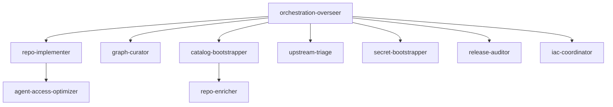

# Agent template catalog — design spec

**Status:** Approved (2026-06-05)  
**Date:** 2026-06-05  
**Owners:** metagit-cli core / web

## Problem

`metagit agent` ships one bundled template (`orchestration-overseer`). Operators need a
full set of role-specific agent archetypes that map to existing prompts, skills, and MCP
tools. Templates must be **schema-validated**, **versioned**, and **UI-ready** so a future
Agent Studio (or Config Studio sibling) can list templates, show metadata, preview rendered
output, and drive install/export without bespoke parsing.

## Goals

1. Add **nine new archetypes** (ten total including overseer).
2. Single **JSON Schema** + Pydantic source of truth for `template.yaml` manifests.
3. **Catalog API** consumable by CLI (`--json`) and `metagit web serve` (v3).
4. **DRY template bodies** via shared partials and vendor frontmatter fragments.
5. **Delegation graph** documenting which archetype dispatches to which.
6. No breaking change to `metagit agent create/export` flags; additive fields only.
7. **Phase 1 ships API + minimal Agents page** in Metagit Web (`/agents`).
8. **Workspace template overlays** under `.metagit/.agent-templates/` (dot-prefixed, inside
   the already-gitignored `.metagit/` tree).

## Non-goals (this phase)

- In-browser template editor with live patch/save (read-only catalog + preview in phase 1).
- Replacing bundled skills; templates reference existing `skills/metagit-*`.

---

## Archetype catalog

| ID | Label | Scope | Tier | Primary prompts | Recommended skills |
|----|-------|-------|------|-----------------|-------------------|
| `orchestration-overseer` | Orchestration overseer | workspace | control_plane | session-start, graph-discover, sync-safe | control-center, context-pack, graph-maintain, gitnexus, cli |
| `repo-implementer` | Repo implementer | repo | specialist | subagent-handoff, sync-safe, context-pack | cli, workspace-sync, repo-impact |
| `graph-curator` | Graph curator | workspace | specialist | graph-discover, graph-maintain | graph-maintain, gitnexus, repo-impact |
| `catalog-bootstrapper` | Catalog bootstrapper | workspace | specialist | catalog-edit, session-start | projects, bootstrap, config-refresh, cli |
| `upstream-triage` | Upstream triage | workspace | specialist | health-preflight, sync-safe | upstream-scan, upstream-triage, multi-repo |
| `repo-enricher` | Repo enricher | repo | specialist | repo-enrich | config-refresh, cli |
| `release-auditor` | Release auditor | workspace | specialist | health-preflight, sync-safe | release-audit, control-center |
| `secret-bootstrapper` | Secret bootstrapper | workspace | specialist | session-start | *(external)* secretzero |
| `agent-access-optimizer` | Agent access optimizer | repo | specialist | repo-enrich | agent-access |
| `iac-coordinator` | IaC coordinator | workspace | control_plane | session-start, catalog-edit, sync-safe | control-center, multi-repo, gitnexus, cli |

### Delegation graph



Control-plane agents coordinate; specialists are dispatched with narrower tool/skill sets.

---

## Schema design (v1)

### Version field

Every `template.yaml` includes:

```yaml
schema_version: "1.0"
```

Registry rejects unknown major versions; minor versions additive.

### Extended manifest model

Extend `AgentTemplateManifest` (Pydantic, `extra=forbid`) with:

| Field | Type | Purpose |
|-------|------|---------|
| `schema_version` | string | Manifest schema version |
| `archetype` | enum | `control_plane` \| `specialist` |
| `scope` | enum | `workspace` \| `project` \| `repo` |
| `prompt_kinds` | string[] | Built-in `metagit prompt` kinds used |
| `mcp_tools` | string[] | Metagit MCP tool names (documentation) |
| `delegates_to` | string[] | Other template IDs this role may spawn |
| `delegated_by` | string[] | Parent template IDs (denormalized for UI) |
| `ui` | object | `category`, `icon`, `color`, `sort_order` |
| `status` | enum | `stable` \| `beta` |
| `version` | string | Template content version (semver) |

Existing fields unchanged: `id`, `label`, `description`, `prompts`, `files`, `vendors`,
`recommended_skills`, `external_skills`.

### JSON Schema artifact

- **Source:** Pydantic models in `src/metagit/core/agent/models.py`
- **Output:** `schemas/agent_template.schema.json`
- **Docs copy:** `docs/reference/schemas/agent_template.schema.json`
- **Generator:** `metagit agent schema` (mirrors `metagit config schema`)
- **CI:** `task generate:schema` extended; fixture validation for every bundled template

### Catalog envelope (API / CLI JSON)

```json
{
  "schema_version": "1.0",
  "templates": [
    {
      "id": "repo-implementer",
      "label": "Repo implementer",
      "archetype": "specialist",
      "scope": "repo",
      "status": "stable",
      "version": "1.0.0",
      "ui": { "category": "Execution", "sort_order": 20 },
      "prompt_kinds": ["subagent-handoff", "sync-safe"],
      "recommended_skills": ["metagit-cli"],
      "vendors": ["claude_code", "cursor"],
      "delegates_to": [],
      "delegated_by": ["orchestration-overseer"]
    }
  ],
  "taxonomy": {
    "archetypes": ["control_plane", "specialist"],
    "scopes": ["workspace", "project", "repo"],
    "vendors": ["claude_code", "cursor", "..."]
  }
}
```

List responses omit raw `.tpl` bodies; detail/preview endpoints add rendered samples.

### Workspace overlay (`.metagit/.agent-templates`)

Operators may override or add templates without polluting the repo root:

```
<workspace-root>/
  .metagit.yml
  .metagit/                          # sync root / session state (gitignored in umbrellas)
    .agent-templates/                # dot dir — non-standard, ignored by catalog/git tools
      <template-id>/
        template.yaml                # partial or full manifest overlay
        *.md.tpl                     # optional body/vendor overrides
        _partials/
```

**Resolution order** (for a given `template_id`):

1. Load bundled template from `src/metagit/data/agent-templates/<id>/` (package data).
2. If `<manifest-root>/.metagit/.agent-templates/<id>/` exists, merge/override:
   - `template.yaml` fields overlay bundled manifest (deep merge for dicts; lists replace).
   - Template files with matching names override bundled `.tpl` sources.
   - Unknown template IDs in overlay only (no bundle) are allowed if manifest validates.

**Manifest root** for overlay path: directory containing `.metagit.yml` (same as session
root from `root_resolver.py`), not the sync mount path unless they coincide.

**Catalog metadata:** each entry includes `source: bundled | overlay | merged` and
`overlay_path` when applicable so the UI can badge customized templates.

**CLI:** `metagit agent list --json` and create/export resolve overlay when `-c` /
`--root` points at a workspace with `.metagit/.agent-templates/`.

---

## Template layout (per archetype)

```
src/metagit/data/agent-templates/<id>/
  template.yaml              # validated manifest
  body.md.tpl                # shared markdown body (partials expanded)
  _partials/                 # optional includes
  <id>.md.tpl                # default export (claude-style)
  <id>.cursor.md.tpl
  <id>.opencode.md.tpl
  <id>.github-copilot.agent.md.tpl
  <id>.skill.md.tpl          # shared skill frontmatter wrapper
  AGENTS.md.fragment.tpl
  manifest.json.tpl
```

### Partial inclusion

Extend `InitTemplateRenderer` / agent renderer with:

```text
{{ include "session-start-checklist" }}
```

Resolves ` _partials/session-start-checklist.md.tpl` relative to template dir.
Max depth 3; cycles forbidden. Enables one shared checklist across ten archetypes.

### Vendor matrix (unchanged rules)

| Install kind | Vendors |
|--------------|---------|
| agent markdown | claude_code, cursor, github_copilot, opencode |
| skill SKILL.md | hermes, openclaw, windsurf, codex |

Each archetype reuses the same vendor matrix as `orchestration-overseer` unless a role
needs tighter tools (e.g. `repo-implementer` omits graph ingest scripts from body).

---

## CLI surface (additive)

| Command | Behavior |
|---------|----------|
| `metagit agent list --json` | Catalog envelope |
| `metagit agent show <id> --json` | Full manifest |
| `metagit agent schema [--output-path]` | Write JSON Schema |
| `metagit agent validate [--template ID]` | Validate all or one manifest |
| `metagit agent preview <id> [--vendor V] [--answers-file]` | Render without write |
| `metagit agent export/create` | Unchanged; gains new template IDs |

---

## Web / UI surface (phase 1)

### HTTP API

New handler `AgentWebHandler` under `src/metagit/core/web/`:

| Route | Response |
|-------|----------|
| `GET /v3/agents/catalog` | Catalog envelope (includes overlay `source` per template) |
| `GET /v3/agents/templates` | List (same as catalog.templates) |
| `GET /v3/agents/templates/{id}` | Manifest + file manifest (not binary) |
| `GET /v3/agents/templates/{id}/preview` | Query: `vendor`, optional answers JSON |

Handlers resolve workspace overlay from the web server `--root` (manifest directory).

Payload types live in `src/metagit/core/web/models.py` alongside existing v3 models.

### Minimal Agents page (phase 1)

Route: **`/agents`** in the Metagit Web SPA (`web/src/pages/AgentsPage.tsx`).

| UI element | Behavior |
|------------|----------|
| Nav link | “Agents” next to Workspace / Config |
| Card grid | One card per template; grouped by `ui.category`; sorted by `sort_order` |
| Badge | `bundled` / `overlay` / `merged` from catalog `source` |
| Detail panel | Label, description, scope, archetype, skills, prompt kinds, delegation list |
| Preview tab | Fetches `/v3/agents/templates/{id}/preview?vendor=cursor` (vendor selector) |
| Install hint | Read-only copy box: `metagit agent create <id> --vendor …` |

No inline editing in phase 1. Reuses TanStack Query + existing layout/theme from
Config Studio / Workspace Console.

**Phase 2 (later):** overlay editor, live validate, export zip, install button that
calls a future `POST /v3/agents/templates/{id}/install` endpoint.

---

## Approach comparison

### A — Extend `template.yaml` only (recommended)

- **Pros:** Matches init-template pattern; ships in package data; easy `uv` install; YAML
  editable; JSON Schema validates manifests.
- **Cons:** Bodies still live as `.tpl` files (preview API reads from disk).

### B — Single `templates.json` bundle

- **Pros:** One file for UI.
- **Cons:** Poor diff ergonomics; large bodies in JSON escape hell; breaks copier-style
  export pattern.

### C — Database / workspace-stored templates

- **Pros:** User customization.
- **Cons:** Out of scope; needs auth and sync.

**Recommendation:** **A** with catalog JSON generated from validated manifests, plus optional
`manifest.json.tpl` per template for offline tooling.

---

## Validation & QA

1. `tests/core/agent/test_agent_catalog.py` — all templates load; schema validates.
2. `tests/core/agent/test_agent_partials.py` — include resolution.
3. `tests/cli/commands/test_agent.py` — list/show/preview per archetype.
4. `tests/core/web/test_agent_web_handler.py` — HTTP catalog routes.
5. `scripts/agent-template-fixtures.yml` — manifest paths for prepush (like manifest-fixtures).
6. `task generate:schema` includes agent template schema.

---

## Migration

1. Add new Pydantic fields with defaults so existing `orchestration-overseer/template.yaml`
   validates after adding `schema_version` + metadata block.
2. Refactor overseer body into partials (no behavior change).
3. Add nine templates in three waves (see implementation plan).
4. Document in `docs/reference/metagit-agent.md` + archetype table.

---

## Decisions (locked)

| Topic | Decision |
|-------|----------|
| Phase 1 UI | **API + minimal `/agents` page** in the same delivery wave as catalog HTTP routes |
| Workspace overlays | **`.metagit/.agent-templates/<id>/`** — dot-prefixed under gitignored `.metagit/` |
| iac-coordinator | Separate template sharing partials; emphasizes platform/IaC docs |

---

## Approval

Approved 2026-06-05. Execute
[implementation plan](../plans/2026-06-05-agent-template-catalog.md).
