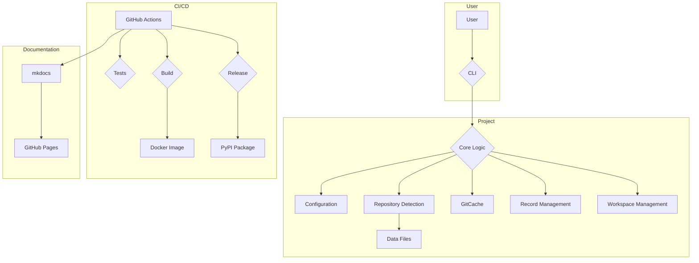

# Metagit-Detect Project Documentation

This document provides a comprehensive overview of the `metagit-detect` project, its components, and their interactions.

## Project Overview

`metagit-detect` is a command-line interface (CLI) tool designed to provide situational awareness for developers and AI agents working with multi-repository projects. It helps in understanding the technical stacks, languages, dependencies, and generated artifacts of a project.

## Components

The project is primarily composed of the following components:

- **CLI (`src/metagit/cli`)**: The main entry point of the application, built using the `click` library. It handles user commands and orchestrates the different functionalities of the tool.
- **Core (`src/metagit/core`)**: Contains the core logic of the application, including:
    - **Configuration Management (`src/metagit/core/config`)**: Manages the project's configuration, which is stored in a `.metagit.yml` file.
    - **Repository Detection (`src/metagit/core/detect`)**: Analyzes the repository to detect languages, frameworks, and other project characteristics.
    - **GitCache (`src/metagit/core/gitcache`)**: Caches Git-related information to improve performance.
    - **Record Management (`src/metagit/core/record`)**: Manages project metadata records.
    - **Workspace Management (`src/metagit/core/workspace`)**: Manages multi-repository workspaces.
- **Data (`src/metagit/data`)**: Contains data files used by the application, such as build files, CI/CD file definitions, and package manager information.
- **Tests (`tests`)**: Contains unit and integration tests for the project, using the `pytest` framework.
- **Documentation (`docs`)**: Contains project documentation, built using `mkdocs`.

## Interactions

The following Mermaid diagram illustrates the interactions between the different components of the `metagit-detect` project:

